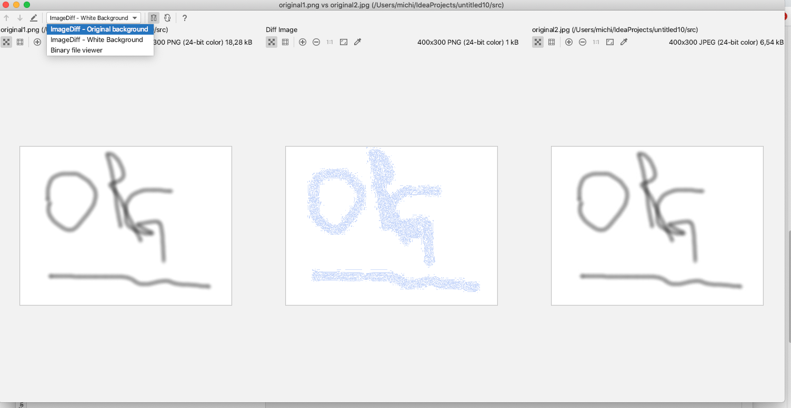

= imgdiff

_imgdiff_ is a plugin for IntelliJ and similar Jetbrains-products.
It shows the diff between two images.

For bugs and comments just use issues.

== Installation

https://plugins.jetbrains.com/plugin/12691-image-diff/

== Usage

* Open diff view of Intellij for two images
* You should see something like the following screenshot
* 
* Select "ImageDiff - White background"
** Diff will be displayed in the middle, same pixel have color white
* Select "ImageDiff - Original background"
** Diff will be displayed in the middle, same pixel have color of original
* Select "ImageDiff - Blinking Diff"
** Diff will be displayed in the middle, differences are blinking.
This is an experimentel feature.
* If an image has been removed or added IntelliJ defaults behavior is used (you can't use imageDiff)
== Development

* Current build state : image:https://api.travis-ci.org/ehmkah/imgdiff.svg?branch=master[link="https://travis-ci.org/ehmkah/imgdiff"]

* Import to intellij with gradle
* Run task `runIde`

* Pullrequests are always welcome :-)
